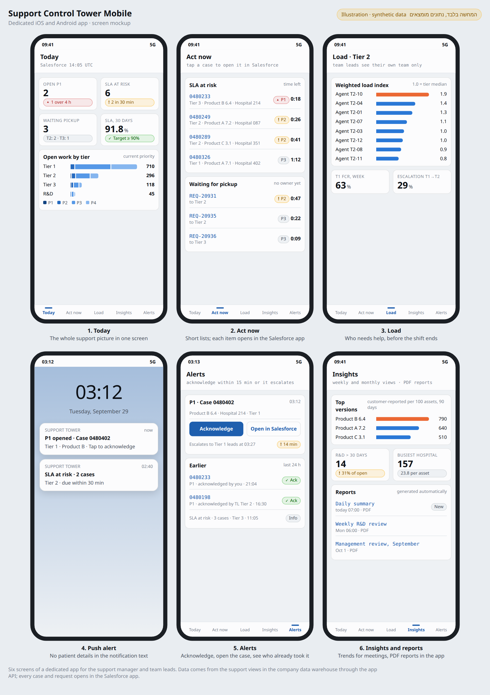

<div dir="rtl">

# Support Control Tower Mobile: מסמך MVP לאפליקציה ייעודית

| | |
|---|---|
| **תאריך** | 2026-09-29 |
| **בעלים** | מנהל התמיכה הטכנית |
| **מה זה** | אפליקציה חדשה ל-iOS ול-Android שמציגה דשבורדים, דוחות והתראות, ונבנית מאפס בלי Spotfire |
| **תלוי ב** | שכבת הנתונים ב-DW (סכמת התמיכה וה-views של המדדים) מתוך מסמך ה-MVP המלא |
| **הדגמה** | איור בסעיף 3, וגרסה אינטראקטיבית (נתונים מומצאים): https://claude.ai/artifact/DDAnhE89An5LxPssAnnLVn |

---

## 0. תקציר

אפליקציה ייעודית לטלפון, שנותנת למנהל התמיכה ולראשי הצוותים תמונת מצב של התמיכה, רשימות לפעולה מיידית, עומס בצוות, מגמות, דוחות, והתראות push עם אישור קבלה והסלמה.

- **הנתונים:** מגיעים מה-views של המדדים ב-DW הארגוני, דרך API ייעודי של האפליקציה. זו אותה שכבת נתונים שכבר תוכננה. האפליקציה לא ניגשת ישירות ל-Salesforce, ל-RingCentral או ל-TFS.
- **פעולות:** כל פעולה על קייס (שיוך, עדכון, תגובה) נעשית באפליקציית Salesforce, שנפתחת בלחיצה מתוך האפליקציה. הפעולה היחידה בתוך האפליקציה היא אישור קבלה של התראה.
- **המחיר של "מאפס":** מה ש-Spotfire היה נותן מוכן צריך לבנות עכשיו לבד: גרפים, הרשאות, דוחות PDF ותחזוקה. לכן ה-MVP דורש צוות פיתוח למשך כ-12 שבועות, ועוד 4 שבועות ניסוי.
- **מה מקבלים בתמורה:** התראות push עם אישור קבלה והסלמה אוטומטית, חוויה שמותאמת לתפקיד, ושליטה מלאה על האבטחה ועל העיצוב.

---

## 1. הבעיה והפתרון

**הבעיה:** התמיכה פועלת 24/7 בשלושה אזורי זמן, עם כ-10,000 קייסים בחודש וכוננים בטירים 2 ו-3. המנהל וראשי הצוותים צריכים לדעת מה המצב, ולהגיב גם כשהם רחוקים מהמחשב: בפגישות, בדרכים, בלילה ובסופי שבוע. היום, כדי לדעת מה קורה, צריך לפתוח מחשב, להיכנס ל-Salesforce ולהריץ דוחות. התראת P1 בלילה מגיעה ב-SMS, ואין דרך לדעת אם מישהו כבר לקח אותה.

**הפתרון בגרסה הפשוטה ביותר:** אפליקציה עם חמש לשוניות, שכל אחת מהן עונה על שאלה אחת:

| לשונית | השאלה |
|---|---|
| Today | הכול בסדר? |
| Act now | במה לטפל עכשיו? |
| Load | מי בצוות צריך עזרה? |
| Insights | מה המגמה, ומה הדוחות האחרונים? |
| Alerts | מה קרה, ומי כבר לקח את זה? |

---

## 2. קהל היעד (Early Adopters)

| קבוצה | גודל | למה הם ראשונים | הרשאה באפליקציה |
|---|---|---|---|
| **מנהל התמיכה** | 1 | מקבל את התראות ה-P1 ואחראי על כל הטירים בכל שעה | Manager: כל הנתונים, כל הטירים |
| **ראשי צוותים** | 7 (3 בטיר 1, 2 בטיר 2, 2 בטיר 3) | הם הגיבוי להתראות P1, ובטירים 2 ו-3 אחראים גם על הכוננים מחוץ לשעות העבודה | TeamLead: כל המסכים, אבל נתונים ברמת סוכן רק על הצוות שלהם |

**לא בגל הראשון:** תומכים, הנהלה, R&D ו-QARA. כדי להרחיב לקהל גדול יותר צריך קודם להוכיח שהאפליקציה אמינה ומאובטחת.

---

## 3. הפיצ'רים ההכרחיים (Core Features)



### 3.1 מסכים

| # | מסך | תוכן | הערות |
|---|---|---|---|
| A1 | **כניסה** | SSO של החברה (Entra ID) עם MFA, ואחר כך פתיחה בביומטריה | בלי שם משתמש וסיסמה נפרדים |
| A2 | **Today** | P1 פתוחים, SLA בסיכון, בקשות שממתינות לשיוך, SLA ל-30 יום מול יעד, עבודה פתוחה לפי טיר ולפי Priority | מסך הבית. נטען מה-cache מיד, ומתרענן ברקע |
| A3 | **Act now** | SLA בסיכון (ממוין לפי הזמן שנשאר), בקשות שלא שויכו, P1 פתוחים | כל שורה נפתחת באפליקציית Salesforce |
| A4 | **Load** | עומס משוקלל לסוכן ביחס לחציון הטיר, FCR של טיר 1, שיעור אסקלציה, עבודת טיר 1 לפי Case Type | ראש צוות רואה רק את הצוות שלו. המנהל בוחר טיר |
| A5 | **Insights** | חמש הגרסאות עם שיעור התקלות הגבוה ביותר, באגים מאושרים, בקשות ב-R&D מעל 30 יום, חמשת בתי החולים העמוסים, SLA חודשי | "מה להגיד בפגישה" |
| A6 | **Reports** (בתוך Insights) | דוח יומי לראשי צוותים, דוח שבועי ל-R&D, Management Review חודשי, כולם PDF | נפתחים בצפיין בתוך האפליקציה ולא נשמרים במכשיר |
| A7 | **Alerts** | היסטוריית התראות של 7 ימים, סטטוס אישור (מי ומתי), וכפתורי Acknowledge ו-Open in Salesforce | ראו 3.2 |
| A8 | **הגדרות** | שעות שקטות להתראות שאינן P1, אזור זמן לתצוגה, יציאה | P1 תמיד מגיע, גם בשעות שקטות |

**עקרונות עיצוב:**
- **מעט רכיבים בכל מסך:** עד 3-4. מספרים גדולים, רשימות קצרות, גרף פשוט אחד. בלי טבלאות רחבות ובלי מסננים מורכבים.
- **סימון מצב:** כל מספר שדורש תשומת לב מסומן בתווית עם סמל וטקסט (למשל "▲ 1 over 4 h"), לא רק בצבע.
- **עדכניות:** חותמת "עודכן לאחרונה" בכל מסך. אם הנתונים ישנים מ-30 דקות, מופיעה אזהרה.
- **מצב כהה, וגודל טקסט:** האפליקציה תומכת במצב כהה ובהגדלת טקסט של מערכת ההפעלה.
- **הגדרות המדדים:** כל מספר מחושב לפי מילון המדדים של מסמך ה-MVP המלא, באותן views ב-DW.

### 3.2 התראות עם אישור קבלה והסלמה

זה הפיצ'ר שאפליקציה ייעודית נותנת, ו-SMS לא.

| שלב | מה קורה | זמן |
|---|---|---|
| 1 | P1 נפתח, או קייס עולה ל-P1 ב-Salesforce | 0 |
| 2 | Push למנהל ולראשי הצוותים של הטיר שמחזיק את הקייס | פחות מדקה |
| 3 | מישהו לוחץ Acknowledge. ההתראה מסומנת אצל כולם "נלקח על ידי X", וההסלמה נעצרת | |
| 4 | אם אף אחד לא אישר: SMS ושיחה טלפונית למנהל (המנגנון הקיים), ו-push לכל ראשי הצוותים | 15 דקות |

**סוגי התראות ב-MVP:**

| התראה | נמענים | ערוץ | בשעות שקטות |
|---|---|---|---|
| P1 חדש או קייס שעלה ל-P1 | מנהל, וראשי הצוותים של הטיר | Push, ואחרי 15 דקות בלי אישור גם SMS ושיחה | כן, תמיד |
| SLA בסיכון, P1/P2 | ראשי הצוותים של הטיר | Push | לא |
| Request של P1/P2 שלא שויך יותר מ-30 דקות | ראשי הצוותים של טיר היעד | Push | לא |

- **תוכן ההתראה:** מספר קייס, Priority, טיר ומוצר. **בלי שם בית חולים ובלי שום פרט על מטופל.** השרתים של Apple ו-Google שמעבירים את ההתראות לא מכוסים ב-BAA. את כל השאר רואים רק אחרי כניסה לאפליקציה.
- **iOS במצב שקט:** כדי ש-P1 יישמע גם כשהטלפון במצב שקט או "נא לא להפריע", צריך הרשאת Critical Alerts מ-Apple. זו הרשאה שמבקשים מ-Apple, והיא לא ניתנת אוטומטית. בלעדיה, מנגנון ה-SMS והשיחה אחרי 15 דקות הוא הגיבוי.

### 3.3 בחוץ, בכוונה

| לא ב-MVP | למה |
|---|---|
| פעולות על קייסים מתוך האפליקציה (שיוך, סטטוס, תגובה) | אפליקציית Salesforce כבר עושה את זה. בנייה מחדש תכפיל את העבודה ואת הסיכון |
| דשבורד QARA | רגיש רגולטורית, וצריך קודם החלטה של QA |
| מדדי טלפון מ-RingCentral | ערך נמוך יחסית בכ-100 שיחות ביום. מתאים לגל שני |
| עבודה בלי רשת, מעבר ל-cache של הצפייה האחרונה | לא נדרש לשאלה "מה המצב עכשיו", ומגדיל את הסיכון לנתונים במכשיר |
| תצוגה לטאבלט, ממשק בעברית | גל שני. התשתית תתמוך בימין לשמאל כבר מההתחלה |
| תומכים כמשתמשים | פי 11 משתמשים (89 במקום 8), ודרישות אחרות |
| דשבורדים למחשב | המסמך הזה עוסק רק בטלפון. אם Spotfire לא ישמש גם במחשב, צריך החלטה נפרדת על הדשבורדים למחשב |

---

## 4. ארכיטקטורה

```
 Salesforce ──(existing DW pipeline, 5-15 min)──> DW: support schema + KPI views
     │                                                   │
     │                                     every 5 min: pre-aggregated tables
     │                                                   ▼
     │                                     App API (Azure Functions / App Service)
     │                                      - Entra ID token check, role + team filter
     │                                      - read-only access to the DW
     │                                                   │  HTTPS
     │                                                   ▼
     │                                     Mobile app (iOS + Android)
     │                                      - encrypted cache, biometric unlock
     │                                      - deep links to the Salesforce app
     │                                                   ▲
     └──(Platform Event on P1)──> Alert service ──> Azure Notification Hubs ──> APNs / FCM
                                    │  (ack, 15-min escalation)
                                    └──> SMS + voice (existing P1 channel)

 Report job (daily/weekly/monthly) ──> PDF ──> Azure Blob (short-lived links) ──> app viewer
```

| רכיב | בחירה מומלצת | למה |
|---|---|---|
| אפליקציה | **React Native עם TypeScript**, קוד אחד ל-iOS ול-Android | צוות אחד לשתי הפלטפורמות, אקוסיסטם גדול, ספריות גרפים וביומטריה בשלות |
| הזדהות | Microsoft Entra ID עם MSAL, MFA ו-Conditional Access | אותו SSO של החברה. הרשאות לפי תפקידים (app roles) |
| API | Azure Functions או App Service, עם Managed Identity לקריאה מה-DW | בלי סיסמאות בקוד. הרשאה לקריאה בלבד |
| נתונים לאפליקציה | טבלאות מסוכמות שמתעדכנות כל 5 דקות מתוך ה-views של המדדים | תשובת API מהירה, והמסד לא נעמס מכל פתיחה של האפליקציה |
| Push | Azure Notification Hubs, ודרכו APNs (Apple) ו-FCM (Google) | שירות אחד לשתי הפלטפורמות, בתוך Azure |
| שירות התראות | Azure Function שמאזינה ל-Platform Event מ-Salesforce ומנהלת אישור קבלה והסלמה | P1 לא מחכה לרענון של ה-DW |
| דוחות PDF | תבנית HTML שמומרת ל-PDF בשרת (למשל Chromium בתוך Azure Container Apps), ונשמרת ב-Azure Blob | בלי Spotfire, הדוחות נבנים מאותם views |
| הפצה | אפליקציה פרטית: Apple Business Manager ו-Managed Google Play, מנוהלות דרך Intune | לא בחנות הציבורית. IT שולט במי שמתקין |

**ה-API ב-MVP (חוזה ראשוני):**

| Endpoint | מה הוא מחזיר |
|---|---|
| `GET /me` | תפקיד, טיר וצוות של המשתמש |
| `GET /today` | נתוני מסך Today |
| `GET /act-now` | רשימות SLA בסיכון, בקשות שלא שויכו ו-P1 |
| `GET /load?tier=` | עומס לפי סוכן (מסונן לפי ההרשאה) |
| `GET /insights` | גרסאות, R&D, בתי חולים, SLA חודשי |
| `GET /reports`, `GET /reports/{id}` | רשימת דוחות, וקישור קצר-מועד ל-PDF |
| `GET /alerts`, `POST /alerts/{id}/ack` | היסטוריית התראות, ואישור קבלה |
| `POST /devices` | רישום המכשיר ל-push |

**כלל:** סינון ההרשאות (תפקיד, צוות) נעשה תמיד בשרת. האפליקציה לעולם לא מקבלת נתונים שהמשתמש לא אמור לראות, גם אם המסך לא מציג אותם.

---

## 5. אבטחה, פרטיות ורגולציה

| נושא | דרישה |
|---|---|
| **צמצום נתונים** | ה-API מחזיר רק שדות מרשימה מאושרת: מספרי קייס, מוצר, גרסה, טיר, Priority, שם בית חולים, שמות סוכנים וזמנים. בלי טקסט חופשי ובלי פרטי מטופלים |
| **הזדהות** | Entra ID עם MFA. אחרי 15 דקות ברקע האפליקציה ננעלת, ונפתחת בביומטריה או בקוד. אחרי 12 שעות צריך להתחבר מחדש |
| **מכשיר** | Conditional Access: גישה רק ממכשיר מנוהל או מאפליקציה מוגנת ב-Intune App Protection (דרך Intune App SDK או App Wrapping Tool) |
| **נתונים במכשיר** | Cache מוצפן (Keychain ב-iOS, Keystore ב-Android), שנשמר עד 24 שעות ונמחק ביציאה או בהסרה מ-Intune. קובצי PDF לא נשמרים |
| **צילומי מסך** | ב-Android: חסימה (FLAG_SECURE). ב-iOS: טשטוש המסך כשעוברים בין אפליקציות |
| **תקשורת** | TLS 1.2 ומעלה, ו-certificate pinning מול ה-API |
| **מכשיר פרוץ** | זיהוי jailbreak או root, וחסימת גישה |
| **Push** | בלי פרטים מזהים בטקסט ההתראה (3.2) |
| **ביקורת** | Audit log לכל קריאת API: מי, מה ומתי |
| **בדיקות** | עמידה ב-OWASP MASVS (רמה L1 כבסיס), ובדיקת חדירות חיצונית לפני העלייה לאוויר |
| **HIPAA** | כל רכיבי Azure בתוך ה-BAA של החברה. APNs ו-FCM לא בתוך ה-BAA, ולכן לא עובר דרכם שום מידע רגיש |
| **רגולציה של מכשור רפואי** | האפליקציה היא כלי תפעולי פנימי ולא מכשיר רפואי, ולא נוגעת בטיפול בחולים. גם החלק של QARA לא בהיקף. **לאשר מול QA** |
| **פרטיות עובדים** | נתוני עומס ברמת סוכן, כמו במסמך הדשבורדים. לבדוק מול HR ו-Legal (UK GDPR) |

---

## 6. דרישות לא פונקציונליות

| דרישה | יעד |
|---|---|
| פתיחת האפליקציה עד מסך Today | פחות מ-2 שניות מה-cache, ופחות מ-5 שניות עם נתונים טריים ברשת סלולרית |
| זמן תגובה של ה-API | p95 פחות משנייה |
| עדכניות נתונים | 5-15 דקות (כמו ה-DW). P1 בזמן אמת, דרך שירות ההתראות |
| זמינות | API: 99.5%. שירות ההתראות: 24/7 |
| יציבות | 99.5% ומעלה מההפעלות בלי קריסה |
| גרסאות מערכת הפעלה | iOS 17 ומעלה, ו-Android 11 ומעלה (לאימות מול הטלפונים בפועל) |
| נגישות | הגדלת טקסט של המערכת, ניגודיות, קורא מסך ל-iOS ול-Android |
| שפה | אנגלית ב-MVP, עם תשתית שתומכת בימין לשמאל |
| תצוגת זמן | אזור הזמן המקומי של המשתמש, עם אפשרות למעבר ל-UTC |

---

## 7. מדדי הצלחה (KPIs)

הניסוי נמשך **4 שבועות**, עם 8 משתמשים.

| מדד | יעד | איך מודדים |
|---|---|---|
| **שימוש של המנהל** | פתיחה לפחות 5 ימים בשבוע | אנליטיקה של האפליקציה |
| **שימוש של ראשי הצוותים** | לפחות 6 מתוך 7 בכל שבוע | אנליטיקה של האפליקציה |
| **זמן לאישור P1** | חציון של פחות מ-5 דקות מה-push ועד Acknowledge | לוג שירות ההתראות |
| **P1 שאושר לפני הסלמה** | 90% ומעלה בתוך 15 דקות | לוג שירות ההתראות |
| **אמינות** | אותם מספרים באפליקציה וב-Salesforce, ב-100% מהבדיקות המדגמיות | השוואה לדוחות ייחוס |
| **יציבות וביצועים** | 99.5% ומעלה בלי קריסה; Today נפתח בפחות מ-2 שניות | כלי ניטור קריסות וביצועים |
| **אבטחה** | 0 אירועים, ו-0 ממצאים ברמת חומרה גבוהה פתוחים מבדיקת החדירות | דוח בדיקת החדירות ודוח Intune |
| **שביעות רצון** | ציון 4 מתוך 5 ומעלה ל"אני לא צריך לפתוח מחשב כדי לדעת מה המצב" | סקר בסוף הניסוי |

**סימן לעצירה:** אם אחרי שבועיים ראשי הצוותים ממשיכים לבדוק ב-Salesforce לפני כל החלטה, או שפחות מחצי מהם פותחים את האפליקציה, עוצרים ומבינים למה, לפני שמרחיבים.

---

## 8. לוח זמנים, צוות ותקציב

### 8.1 לוח זמנים: 12 שבועות עד העלייה לאוויר, ועוד 4 שבועות ניסוי

| שבועות | שלב | תוצרים |
|---|---|---|
| **1-2** | אפיון ועיצוב | תרשימי זרימה, עיצוב מסכים ב-Figma, חוזה API, תוכנית אבטחה, בקשת הרשאת Critical Alerts מ-Apple |
| **3-4** | ספרינט 1 | כניסה (Entra ID), API בסיסי, טבלאות מסוכמות, מסך Today |
| **5-6** | ספרינט 2 | Act now, Load, הרשאות לפי צוות, קישורים לאפליקציית Salesforce |
| **7-8** | ספרינט 3 | שירות התראות, push, אישור קבלה, הסלמה ל-SMS ולשיחה |
| **9-10** | ספרינט 4 | Insights, דוחות PDF, הגדרות, הקשחת אבטחה |
| **11-12** | בדיקות ועלייה לאוויר | בדיקת חדירות, בדיקות קבלה עם 8 המשתמשים, הפצה דרך Intune |
| **13-16** | ניסוי | מדידת המדדים מסעיף 7, והחלטה על גל שני |

**תלות:** שכבת הנתונים (סכמת התמיכה וה-views ב-DW) צריכה להיות מוכנה עד שבוע 4. זה ברוב המקרים אותו עבודה שכבר מתוכננת ל-DBA במסמך ה-MVP המלא.

### 8.2 צוות

| תפקיד | היקף | כמה זמן |
|---|---|---|
| מפתח/ת מובייל (React Native) | 2 | שבועות 3-12 |
| מפתח/ת Backend (Azure, API, התראות, דוחות) | 1 | שבועות 1-12 |
| מעצב/ת UX/UI | חצי משרה | שבועות 1-6 |
| QA (בדיקות ידניות ואוטומטיות על מכשירים) | 1 | שבועות 5-12 |
| DevOps / אבטחה (Intune, Conditional Access, CI/CD) | חלקי | לאורך הפרויקט |
| בעלים מקצועי (מנהל התמיכה) | כ-10% | לאורך הפרויקט: החלטות, בדיקות קבלה |

### 8.3 תקציב

**רכיבי העלות.** הכמויות הן הערכה שלי, והסכומים ימולאו מהצעות מחיר:

| רכיב | כמות משוערת | סכום |
|---|---|---|
| פיתוח (פנימי או ספק חיצוני) | כ-45-55 שבועות-אדם (לפי הצוות בסעיף 8.2) | לפי תעריף |
| עיצוב UX/UI | כ-3 שבועות-אדם | לפי תעריף |
| בדיקת חדירות חיצונית | בדיקה אחת לפני העלייה | לפי הצעת מחיר |
| Apple Developer Program | מנוי שנתי | 99 דולר לשנה |
| Google Play Console | חד-פעמי | 25 דולר |
| Azure: API, Notification Hubs, Functions, Blob, Container Apps | שימוש של 8 משתמשים | נמוך, לחישוב על ידי IT |
| Intune | אם כבר בשימוש בארגון | 0 |
| תחזוקה אחרי העלייה | עדכוני iOS ו-Android, תיקונים, אבטחה | כ-20-30% מעלות הפיתוח בשנה (הערכה מקובלת, לאימות) |

> **ההערכות האלה הן שלי**, כדי לתת סדר גודל. צוות הפיתוח או הספק צריכים לתת הערכה משלהם אחרי שלב האפיון.

---

## 9. סיכונים

| סיכון | סבירות | השפעה | מיטיגציה |
|---|---|---|---|
| שכבת הנתונים ב-DW לא מוכנה בזמן | בינונית | חוסמת | להתחיל בה מיד. האפליקציה יכולה להתחיל עם נתוני דמה עד שבוע 4 |
| **זחילת היקף:** "בוא נוסיף עוד מסך", עד שבונים מחדש מערכת BI | גבוהה | גבוהה | רשימת הפיצ'רים בסעיף 3 סגורה. כל תוספת עוברת לגל שני |
| push לא מגיע (מצב שקט, מכשיר כבוי, עיכוב אצל Apple או Google) | בינונית | גבוהה ל-P1 | הסלמה ל-SMS ולשיחה אחרי 15 דקות, ובקשת Critical Alerts |
| טלפונים אישיים (BYOD) בלי ניהול | בינונית | גבוהה (HIPAA) | Intune App Protection, ובלי מידע רגיש באפליקציה בכלל |
| אין בארגון צוות מובייל | בינונית | גבוהה | ספק חיצוני, עם דרישת העברה ל-IT ותיעוד (כמו ביועץ של הדשבורדים) |
| עלות תחזוקה שנתית לא מתוקצבת | גבוהה | בינונית | לתקצב מראש, ולהגדיר בעלים לאפליקציה אחרי העלייה |
| הרשאת Critical Alerts לא מאושרת על ידי Apple | בינונית | נמוכה | ה-SMS והשיחה נשארים הגיבוי |
| קישורים נפתחים בדפדפן ולא באפליקציית Salesforce | בינונית | נמוכה | לבדוק בספרינט 2, ולהתאים את פורמט הקישור |

---

## 10. שאלות פתוחות

| # | שאלה | למה זה חשוב | מול מי |
|---|---|---|---|
| Q1 | הטלפונים של המנהלים: של החברה, אישיים, או שניהם? ומה החלוקה בין iPhone ל-Android? | קובע את מודל האבטחה ואת סדר הבדיקות | IT |
| Q2 | Intune כבר בשימוש בארגון? | אם לא, צריך פתרון ניהול מכשירים אחר | IT |
| Q3 | מי מפתח: צוות פנימי או ספק חיצוני? | קובע לוח זמנים, עלות ובעלות על הקוד | מנהל התמיכה / IT / רכש |
| Q4 | באיזו טכנולוגיה ה-DW (Azure SQL, Synapse, Fabric, אחר)? | משפיע על ה-API ועל הטבלאות המסוכמות | DBA |
| Q5 | האם אפשר לשלוח Platform Event מ-Salesforce ל-Azure (Flow או Apex)? | זה הטריגר להתראות P1 | Salesforce Admin |
| Q6 | האם Spotfire יישאר לדשבורדים במחשב? | אם לא, צריך פתרון נפרד למחשב | מנהל התמיכה |
| Q7 | ממשק בעברית נדרש כבר ב-MVP? | ראשי הצוותים בארה"ב ובבריטניה. אני מניח אנגלית | מנהל התמיכה |
| Q8 | מי הבעלים של האפליקציה אחרי העלייה (תיקונים, עדכוני מערכת הפעלה, משתמשים חדשים)? | בלי בעלים, האפליקציה מפסיקה לעבוד בעדכון הבא של iOS | מנהל התמיכה / IT |

</div>
