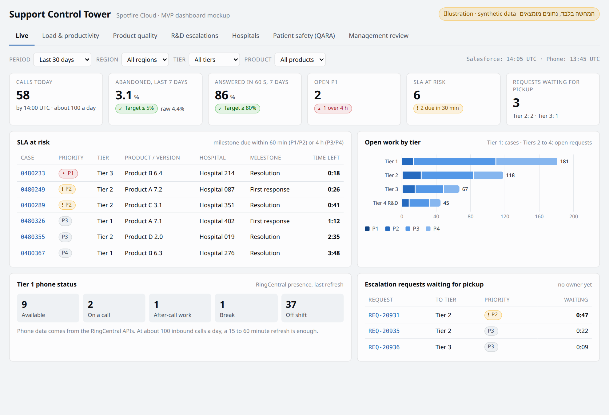

# Support Control Tower: מסמך MVP מקוצר

| | |
|---|---|
| **תאריך** | 2026-09-26 |
| **בעלים** | מנהל התמיכה הטכנית |
| **פלטפורמה** | Spotfire Cloud, על גבי ה-DW הארגוני הקיים |
| **מסמך מלא** | MVP-Support-Control-Tower (הגדרות מדדים, ארכיטקטורה וחבילות עבודה) |

---

## 1. הבעיה והפתרון

**הבעיה:** מחלקת התמיכה מטפלת בכ-10,000 קייסים בחודש עבור יותר מ-500 בתי חולים, בארבעה טירים ובשלוש יבשות. הנתונים קיימים ב-Salesforce, ב-RingCentral וב-TFS, אבל אין תמונה אחת של מצב התמיכה. כדי לענות על שאלות בסיסיות צריך היום להרכיב דוחות ידנית:
- איפה העומס עכשיו?
- איזו גרסה מייצרת הכי הרבה תקלות?
- מה תקוע ב-R&D?
- איזה בית חולים צורך הכי הרבה תמיכה?

**הפתרון בגרסה הפשוטה ביותר:** סט דשבורדים ב-Spotfire Cloud, שקוראים נתוני Salesforce מה-DW הקיים ומתעדכנים כל 5-15 דקות. מכל שורה אפשר לעבור בלחיצה לקייס ב-Salesforce, ובנוסף מוגדרת התראת P1 מיידית.
- **בלי מערכת חדשה ובלי מסד חדש:** ה-DW קיים, ו-Spotfire Cloud כבר מחובר אליו.
- **בלי כתיבה חזרה ל-Salesforce:** Salesforce נשארת מערכת הרשומה.

---

## 2. קהל היעד (Early Adopters)

| קבוצה | גודל | למה הם ראשונים | מה הם מקבלים ביום הראשון |
|---|---|---|---|
| **מנהל התמיכה** | 1 | הוא מקבל את כל ההחלטות שהמערכת משרתת, והוא היום זה שמרכיב את הדוחות ידנית | תמונה אחת של כל הטירים, ושאלות שנענות בלי להכין דוח |
| **ראשי צוותים** | 7 (3 בטיר 1, 2 בטיר 2, 2 בטיר 3) | הם מחליטים כל יום על חלוקת עבודה, והם ירגישו ראשונים אם הנתונים לא נכונים | עומס לפי סוכן, SLA בסיכון, ובקשות שלא שויכו |

**לא בגל הראשון:** הנהלה, R&D ו-QARA. הם יקבלו תוצרים (דוחות) אחרי שהמנהל וראשי הצוותים יאשרו שהמספרים אמינים. לא כדאי להציג להנהלה מספר שלא נבדק מול מי שעובד עם הנתונים כל יום.

---

## 3. הפיצ'רים ההכרחיים (Core Features)

**בתוך ה-MVP:** רק מה שנדרש כדי שהמשתמשים מסעיף 2 יקבלו ערך מהיום הראשון.

| # | פיצ'ר | הערך שהוא נותן | למה הוא הכרחי |
|---|---|---|---|
| F1 | **שכבת נתונים:** סכמת תמיכה ב-DW עם קייסים, בקשות (Requests), SLA, Assets והיסטוריית סטטוסים | בסיס אחד ואמין לכל המדדים | בלעדיה אין שום דבר אחר |
| F2 | **Live:** P1 פתוחים, SLA בסיכון, בקשות שלא שויכו, עבודה פתוחה לפי טיר | התערבות לפני שיש הפרה | השאלה היומית של כל ראש צוות |
| F3 | **עומס והספק:** עומס משוקלל לסוכן, עבודת טיר 1 לפי Case Type, FCR ושיעור אסקלציה | חלוקת עבודה והחלטות על כוח אדם | החלטה D2-D3 |
| F4 | **איכות מוצר:** תקלות ל-100 Assets לפי גרסה, באגים מאושרים ודפוסי מוצר | אילו גרסאות לדחוף ל-R&D | החלטה D1 |
| F5 | **R&D:** בקשות פתוחות לטיר 4 לפי גיל, ורשימה של אלה שפתוחות יותר מ-30 יום | שיחה שבועית עם R&D על בסיס עובדות | החלטה D4 |
| F6 | **בתי חולים:** דירוג לפי עומס, מוחלט ומנורמל למספר ה-Assets | זיהוי לקוחות שדורשים טיפול יזום | החלטה D5 |
| F7 | **קישור ל-Salesforce:** מכל שורה לקייס, לבקשה או לחשבון | ממספר לפעולה בלחיצה אחת | בלעדיו הדשבורד רק מדווח ולא עוזר לפעול |
| F8 | **התראת P1:** מייל, SMS ושיחה טלפונית, ישירות מ-Salesforce | תגובה תוך פחות מ-2 דקות | P1 בבית חולים לא יכול לחכות לרענון של דשבורד |

**בחוץ, בכוונה (גל שני, אחרי שה-MVP הוכיח את עצמו):**

| לא ב-MVP | למה נדחה |
|---|---|
| מדדי טלפון מ-RingCentral | כ-100 שיחות ביום. הערך נמוך יחסית לאינטגרציה נוספת, וכל העבודה ממילא נרשמת כקייסים ב-Salesforce |
| דשבורד QARA | צריך קודם החלטה של QA אם המערכת נחשבת חלק מה-QMS. אסור שזה יעכב את השאר |
| דוח Management Review אוטומטי | בחודש הראשון מייצאים ידנית מהדשבורדים. אוטומציה רק אחרי שהתוכן יציב |
| יעדים (אדום / צהוב / ירוק) | קודם 4-6 שבועות של מדידה, ורק אחר כך קובעים יעדים |
| CTI, שאיבה מ-TFS, חיזוי עומסים | שלב 3 |

---

## 4. מדדי הצלחה (KPIs)

הניסוי נמשך **4 שבועות** מהעלייה לאוויר. בסופם מתקבלת החלטה אם ממשיכים לגל השני.

| מדד | יעד | איך מודדים |
|---|---|---|
| **אמינות הנתונים** | פער 0 מול Salesforce ב-10 בדיקות מדגמיות | השוואה לדוחות ייחוס ב-Salesforce |
| **שימוש של ראשי הצוותים** | 7 מתוך 7 נכנסים לפחות 3 פעמים בשבוע, בכל אחד מ-4 השבועות | לוג הגישה של Spotfire |
| **שימוש של המנהל** | כניסה בכל יום עבודה | לוג הגישה של Spotfire |
| **חיסכון בזמן** | הכנת הסיכום החודשי להנהלה לוקחת פחות משעה | השוואה לזמן שלוקח היום (למדוד לפני העלייה) |
| **החלטות** | לפחות החלטה מתועדת אחת על בסיס המערכת מכל סוג: כוח אדם, גרסה ל-R&D, בית חולים | רשימת החלטות שהמנהל מתחזק |
| **עדכניות** | הנתונים בני פחות מ-15 דקות ב-95% מהזמן | חותמת "עודכן לאחרונה" וניטור הטעינה |
| **התראת P1** | פחות מ-2 דקות מהאירוע, בכל שלושת הערוצים | בדיקה יזומה ומעקב אחרי התראות אמיתיות |

**סימן לכישלון שמחייב עצירה:** אם אחרי שבועיים ראשי הצוותים עדיין בודקים את המספרים מול Salesforce לפני כל החלטה, סימן שהם לא סומכים על הנתונים. במקרה כזה עוצרים ומתקנים את שכבת הנתונים, ולא מוסיפים פיצ'רים.

---

## 5. לוח זמנים ותקציב

### 5.1 לוח זמנים: 6 שבועות עד העלייה לאוויר, ועוד 4 שבועות ניסוי

| שבוע | מה קורה | מי |
|---|---|---|
| **1** | שמירת היסטוריית Salesforce (דחוף); הזמנת עבודה ליועץ והסכם גישה לנתונים; תיאום עם הבעלים של ה-DW; אישור מילון המדדים ומיפוי ה-Case Type | Salesforce Admin, DBA, מנהל התמיכה |
| **2-3** | שכבת נתונים (F1); התראת P1 (F8) | DBA, Salesforce Admin, IT |
| **3-5** | דשבורדים (F2-F7) | יועץ חיצוני |
| **6** | בדיקות קבלה עם ראשי הצוותים, כיול משקלי העומס, העברה ל-IT, עלייה לאוויר | ראשי צוותים, יועץ, IT |
| **7-10** | תקופת הניסוי, מדידת המדדים מסעיף 4, והחלטה על גל שני | מנהל התמיכה |

### 5.2 תקציב

**רכיבי העלות.** הכמויות הן הערכה שלי, ואת הסכומים צריך למלא מהצעות המחיר:

| רכיב | כמות משוערת | סכום |
|---|---|---|
| יועץ Spotfire חיצוני (F2-F7, בדיקות והעברה ל-IT) | כ-25-35 ימי עבודה | לפי הצעת מחיר |
| רישיונות Spotfire Cloud | כ-11: מנהל, 7 ראשי צוותים, 2 IT, יועץ (זמני) | לפי מחירון הספק |
| תצוגה על מסך קיר | 1 (מודל רישוי לבדיקה מול הספק) | לפי מחירון הספק |
| שירות SMS ושיחות להתראת P1 | כמה עשרות הודעות בחודש | זניח |
| DW ותשתית Azure | קיימים | 0 (בכפוף להסכמה של הבעלים של ה-DW) |

**זמן של צוותים פנימיים (לא בכסף, אבל זה משאב אמיתי):**

| צוות | הערכה |
|---|---|
| DBA | כ-10-15 ימי עבודה (תלוי כמה חסר היום ב-DW) |
| Salesforce Admin | כ-5-7 ימי עבודה |
| IT | כ-5 ימי עבודה, ואחר כך תחזוקה שוטפת |
| מנהל התמיכה וראשי הצוותים | כ-3-4 ימים בסך הכול: הגדרות, בדיקות קבלה וכיול |

> **ההערכות האלה הן שלי**, ונועדו לתת סדר גודל. בפגישה כל צוות צריך לתת הערכה משלו (פרק 13 במסמך המלא), והיא תחליף את הטבלה הזו.

