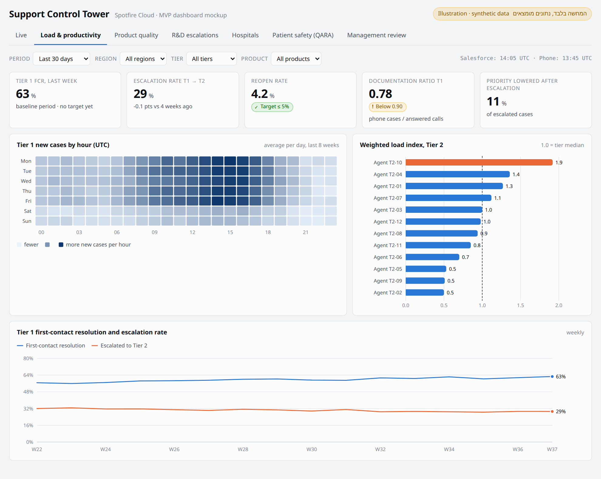
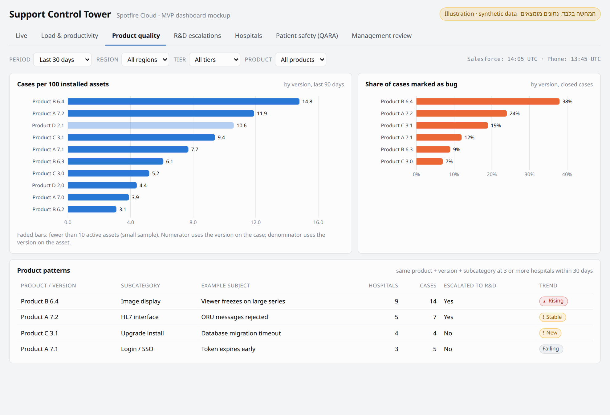
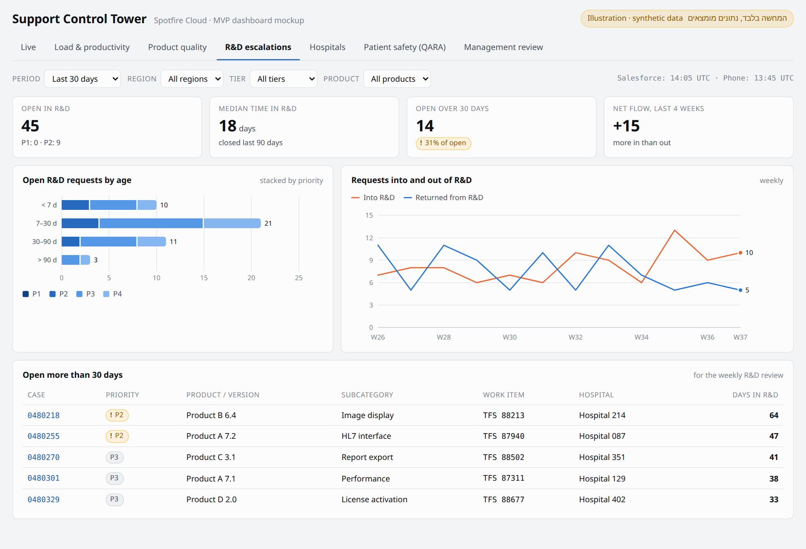
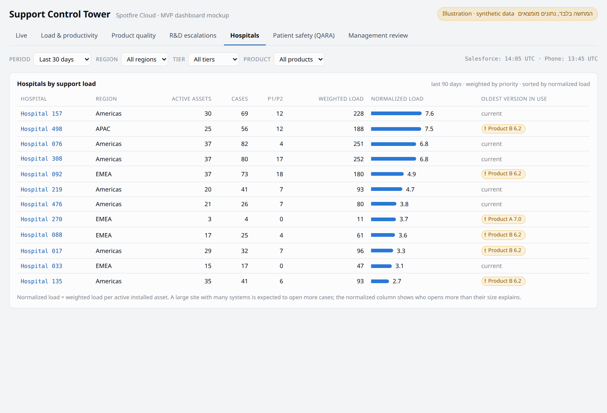
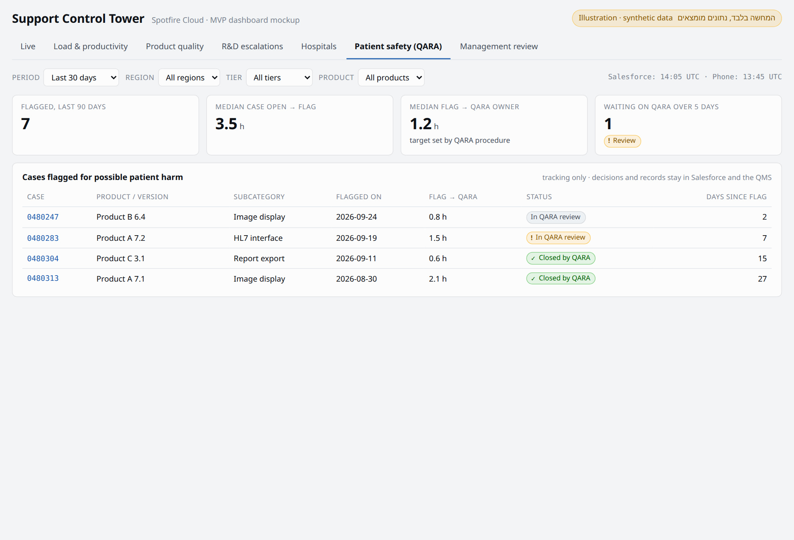
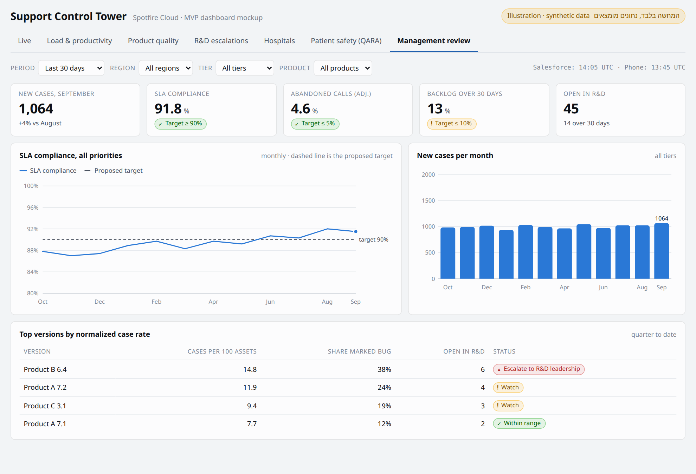

<div dir="rtl">

# מסמך MVP: מערכת בקרה ודשבורדים לתמיכה הטכנית (Support Control Tower)

| | |
|---|---|
| **גרסה** | 0.3 (טיוטה לדיון) |
| **תאריך** | 2026-09-26 |
| **בעלים** | מנהל התמיכה הטכנית |
| **קהל היעד של המסמך** | הנהלה, IT, Salesforce Admin, DBA |
| **מטרת הדיון** | קבלת הערכות זמן מכל צוות לחלק שלו (פרק 13) ואישור להתחיל את שלב 0 |
| **פלטפורמת BI** | Spotfire Cloud |
| **מערכות מקור** | Salesforce Service Cloud, Avaya Cloud Office (פלטפורמת RingCentral), TFS (טיר 4 / R&D), DW ארגוני קיים |
| **הדגמה** | אילוסטרציה של הדשבורדים בפרק 9, וגרסה אינטראקטיבית (נתונים מומצאים): https://claude.ai/artifact/8sXfZ58uu8MbR4n8NjUZ22 |
| **סטטוס** | טיוטה. החלטות פתוחות בפרק 17 |

---

## 0. תקציר מנהלים

המערכת היא שכבת בקרה ב-Spotfire Cloud מעל הנתונים שכבר קיימים ב-Salesforce וב-Avaya Cloud Office. היא לא מחליפה אף אחת מהן. Salesforce נשארת מערכת הרשומה לקייסים, לבקשות האסקלציה (Requests), ל-SLA ולסימון QARA. Spotfire מציגה, מצליבה ומתריעה. מכל דשבורד אפשר לעבור בלחיצה לקייס או לבקשה ב-Salesforce.

**ה-MVP עונה על שש שאלות:**
1. אילו מוצרים וגרסאות מייצרים הכי הרבה תקלות ובאגים, בנרמול לבסיס המותקן.
2. מה ההספק של הסוכנים ושל הצוותים.
3. מה מצב האסקלציות ל-R&D (טיר 4).
4. מה העומס בכל טיר, עכשיו ולאורך זמן.
5. אילו בתי חולים מייצרים הכי הרבה עומס, במונחים מוחלטים ובנרמול לגודל.
6. מה המצב עכשיו: P1 פתוחים, SLA בסיכון, בקשות אסקלציה שממתינות לשיוך, ומדדי טלפון.

**מה נדרש מכל צוות:** פרק 13 מפרט לכל צוות את המשימות שלו, התוצרים והתלויות, עם עמודה להערכת זמן. **זו המטרה של הפגישה.** פרק 9 מציג אילוסטרציה של כל הדשבורדים.

**חמישה דברים שמשנים את התוכנית:**
1. **Avaya Cloud Office עובר ל-RingCentral.** ACO הוא מוצר של RingCentral שנמכר תחת המותג Avaya. לפי דיווחים מיולי 2026, RingCentral מעבירה את כל לקוחות ACO לפלטפורמה ולמותג שלה. המשמעות: את האינטגרציה צריך לבנות מול ה-API של RingCentral, ולתאם את לוח הזמנים עם ההגירה. זו גם הזדמנות לבחון אינטגרציית CTI ל-Salesforce במסגרת ההגירה, והיא תסגור את הפער הגדול ביותר בנתונים היום (שיחות שלא מקושרות לקייסים).
2. **בהיקף של כ-100 שיחות ביום, אין צורך ב-Live טלפוני ברזולוציה של שניות.** רענון של 15-60 דקות מספיק. זה מוריד את הדרישה ל-API בזמן אמת, שלא ברור בכלל שקיים ב-ACO.
3. **כבר קיים בארגון DW עם נתוני Salesforce.** לכן לא בונים מסד חדש, אלא מרחיבים את הקיים. זה יכול לחסוך ל-DBA שבועות. צריך לבדוק אילו אובייקטים יש בו, באיזו תדירות הוא מתעדכן, והאם הוא בתוך ה-BAA.
4. **צריך לשמור את ההיסטוריה של Salesforce כבר עכשיו.** אם אין Field Audit Trail, Salesforce שומרת היסטוריית שדות בערך 18 חודשים (ועד 24 דרך ה-API). כל חודש של המתנה מוחק חודש של נתונים לצמיתות.
5. **יועץ חיצוני יבנה את הדשבורדים.** הוא יעבוד עם נתונים שמקורם ב-Salesforce, ולכן צריך לסגור איתו הסכם (BAA/NDA) או לתת לו לפתח על נתונים מוסווים. בנוסף צריך לקבוע דרישות העברה ל-IT (13.4), אחרת IT יקבל מערכת שהוא לא יודע לתחזק.

**לוח זמנים:** ההערכה הראשונית שלי היא דשבורדים על נתוני Salesforce בערך בשבוע 5-6. אם ה-DW הקיים מכסה את רוב האובייקטים, זה יכול להיות מוקדם יותר. הערכות הזמן של הצוותים (פרק 13) יחליפו את ההערכה הזו.

---

## 1. רקע ובעיה

- ארגון תמיכה גלובלי ביותר מ-500 בתי חולים. כל Account ב-Salesforce הוא בית חולים.
- **נפחים:** כ-100 שיחות ביום, כ-50 מיילים ביום, וכ-1,000 קייסים חדשים בחודש בטיר 1.
- **טיר 1:** כ-50 תומכים בארה"ב, 24/7. מספר טלפון אחד לכל העולם, תמיכה באנגלית. לקוחות פונים רק לטיר 1.
- **טיר 2:** כ-25 תומכים בניו יורק ובאנגליה, follow-the-sun, וכונן בשעות שאין בהן תומך.
- **טיר 3:** כ-14 תומכים בארה"ב ובישראל, follow-the-sun וכונן.
- **טיר 4:** R&D, עובדים ב-TFS.
- **אסקלציה:** כשמסלימים, נפתח בתוך הקייס Request חדש, והטיר הבא עובד עליו. כל העבודה של טירים 2-4 מתבצעת על Requests.
- **Priority:** נקבע על ידי מי שפותח את הקייס, ויכול להשתנות במהלך הטיפול או אחרי אסקלציה. ה-SLA מתעדכן בהתאם.
- **סיווג:** קטגוריה (כ-20 ערכים) ותת-קטגוריה (5-10 ערכים לכל קטגוריה, כ-150 בסך הכול). בסגירת קייס ממלאים Root Cause. באג מסומן בשדה נפרד, לא ב-Root Cause.
- **בסיס מותקן:** הגרסה ב-Asset מתעדכנת ידנית על ידי Field Service.
- **כוננים:** לכל כונן יש משתמש ב-Salesforce, כך שידוע מי טיפל בכל קייס. לוח הכוננויות מנוהל ידנית ולא נכנס למערכת.
- **QARA:** קייס שיש בו חשש לפגיעה בחולה מסומן ב-Salesforce ומועבר ל-QARA.
- **ראשי צוותים:** 7 בסך הכול (לאימות, ראו 17).
- **מסכים:** יש מסכים בחדרי התמיכה, ומי שעובד מהבית נכנס מרחוק.
- **יעדים:** אין היום יעדים רשמיים.

**הבעיה:** הנתונים קיימים, אבל הם מפוזרים בין שלוש מערכות. אין תמונה אחת של מצב התמיכה בכל רגע, וההצלבות נעשות ידנית, אם בכלל.

---

## 2. ההחלטות שהמערכת צריכה לשרת

| # | החלטה | מי מחליט | תדירות | דשבורד |
|---|---|---|---|---|
| D1 | אילו מוצרים וגרסאות לדחוף ל-R&D לתיקון | מנהל התמיכה מול R&D ו-Product | שבועי / חודשי | D-Quality |
| D2 | הקצאת כוח אדם: העברה בין טירים, תגבור משמרות, גיוס | מנהל התמיכה וראשי צוותים | יומי / חודשי | D-Live, D-Load |
| D3 | הספק וביצועי סוכנים: אימון, חלוקת עבודה, הכרה | ראשי צוותים | שבועי | D-Load (הרשאה מוגבלת) |
| D4 | מעקב והסלמה של בקשות שתקועות ב-R&D | מנהל התמיכה מול ראש R&D | שבועי | D-R&D |
| D5 | שיחה יזומה עם בית חולים עמוס | מנהל התמיכה ו-Account Management | חודשי | D-Customer |
| D6 | התערבות מיידית: P1, SLA לפני הפרה, בקשה שלא שויכה | מנהל התמיכה וראשי צוותים | בזמן אמת | D-Live, התראות |

---

## 3. משתמשים, הרשאות ורישוי

| תפקיד | גישה | רישיון Spotfire Cloud | מה רואה |
|---|---|---|---|
| מנהל התמיכה | אינטראקטיבית | 1 | הכול |
| ראשי צוותים | אינטראקטיבית | 7 (לאימות) | כל הדשבורדים. נתונים ברמת סוכן רק על הצוות שלהם |
| IT (תחזוקה) | אינטראקטיבית ופיתוח | לפי IT | הכול |
| יועץ חיצוני (פיתוח) | פיתוח, לתקופת הפרויקט | 1, זמני | לפי ההסכם (13.4) |
| מסכים בחדרי התמיכה | D-Live בלבד | **לבדיקה מול הספק** | D-Live |
| הנהלה | דוח PDF חודשי | לא | רמת צוות ומוצר בלבד |
| R&D, Product | דוח PDF שבועי | לא | איכות מוצר ו-R&D |
| QARA | דוח PDF או גישה אינטראקטיבית | לאישור (17) | D-Safety בלבד |

- **מסכי קיר:** מסך שמציג Spotfire צריך משתמש מחובר. חיבור קבוע עם משתמש של אדם אחד, או משתמש משותף, עלול להפר את תנאי הרישוי ואת כללי אבטחת המידע. צריך לבדוק מול הספק מה המודל לתצוגה על מסך (kiosk).
- ההרשאות ייושמו לפי קבוצות Entra ID עם SSO, כולל row-level security לנתוני סוכנים ולנתוני QARA.

---

## 4. היקף ה-MVP

### 4.1 בפנים
- שימוש ב-DW הקיים, והרחבה שלו לאובייקטים ולתדירות הנדרשים. backfill של 24 חודשים.
- שאיבה מ-ACO/RingCentral: נתונים מצטברים לפי תור וסוכן, ורשומות שיחה בודדות, כל 15-60 דקות.
- שבעה דשבורדים (פרק 9), מילון מדדים אחד (פרק 8) ויעדים מוצעים (8.9).
- drill-through מכל טבלה או נקודה בגרף לקייס, לבקשה, לחשבון או ל-Asset ב-Salesforce.
- דוחות PDF מתוזמנים (פרק 10).
- התראות: P1 במייל, SMS ושיחה טלפונית; SLA בסיכון ובקשות שלא שויכו במייל.

### 4.2 בחוץ (במכוון)
| לא ב-MVP | למה | מתי |
|---|---|---|
| אינטגרציית CTI לטלפוניה | פרויקט טלפוניה בפני עצמו | **לבחון במסגרת ההגירה ל-RingCentral** |
| Live טלפוני ברזולוציה של שניות | לא נחוץ בכ-100 שיחות ביום, ולא ברור שה-API מאפשר | לא מתוכנן |
| לוח כוננויות | מנוהל ידנית על ידי הכוננים | לא מתוכנן |
| שאיבה ישירה מ-TFS | שדה הבאג ו-Root Cause בקייס מספיקים ל-MVP | שלב 3 |
| Field Service ו-RMA | לא רלוונטי למחלקת התמיכה | לא מתוכנן |
| טקסט חופשי (Description, Comments, גוף מיילים) | סיכון PHI, ולא נדרש לאף החלטה | לא מתוכנן |
| חיזוי עומסים (forecasting / WFM) | צריך 6-12 חודשי היסטוריה נקייה | אחרי MVP |
| כתיבה חזרה ל-Salesforce מ-Spotfire | Spotfire לקריאה בלבד | לא מתוכנן |

---

## 5. מקורות נתונים

### 5.1 Salesforce Service Cloud (מקור עיקרי)

| אובייקט | שימוש | שדות מרכזיים (לאימות מול ה-org) |
|---|---|---|
| `Case` | קייסים (העבודה של טיר 1) | Id, CaseNumber, CreatedDate, ClosedDate, Status, Priority, Origin, OwnerId, AccountId, AssetId, Product, Version, Category, Subcategory, Root Cause, **Bug flag**, דגל QARA, SystemModstamp |
| **`Request`** (אובייקט האסקלציה) | **העבודה של טירים 2-4.** כל אסקלציה היא Request בתוך הקייס | Id, CaseId, Tier, OwnerId, Status, Priority (אם יש), CreatedDate, ClosedDate, מזהה TFS (לטיר 4) |
| `CaseHistory` וההיסטוריה של `Request` | זמן בכל סטטוס, מעברי Owner, שינויי Priority | Field, OldValue, NewValue, CreatedDate |
| `CaseMilestone` | SLA: יעד, עמידה, הפרה | MilestoneType, TargetDate, CompletionDate, IsViolated |
| `Entitlement`, `BusinessHours` | שעות עבודה ו-SLA לכל אזור | |
| `Account` | בית חולים | Region, Country |
| `Asset` | בסיס מותקן | Product, Version, Status |
| `User`, `Group` (Queues) | סוכנים, כוננים, צוותים, תורים | |
| `EmailMessage` (מטא-דאטה בלבד) | זמן תגובה ראשונה במייל | CreatedDate, Incoming, ParentId. **בלי גוף ההודעה** |

**החלטות תכנון:**
- **Request הוא יחידת העבודה של טירים 2-4.** עומס, זמן בטיר והספק בטירים 2-4 נמדדים על Requests פתוחים וסגורים, לא על קייסים. קייס אחד יכול להכיל כמה Requests (למשל טיר 2 ואחר כך טיר 3).
- **את ה-SLA לא מחשבים מחדש ב-Spotfire.** לוקחים את `CaseMilestone` כמו שהוא. **פתוח:** האם יש SLA גם ל-Request, או רק לקייס (17).
- **Priority שמשתנה:** קייס פתוח מוצג לפי ה-Priority הנוכחי. קייס סגור מדווח לפי ה-Priority בסגירה ולפי הגבוה ביותר שהיה לו. "שיעור שינוי עדיפות" הוא מדד בפני עצמו (8.2).
- **גרסה: קייס מול Asset.** המונה לוקח את הגרסה מהקייס, והמכנה (בסיס מותקן) לוקח אותה מה-Asset. ב-Data Health נציג כמה פעמים הן לא תואמות.
- **API limits:** בכ-1,000 קייסים בחודש, השאיבה האינקרמנטלית זניחה.

### 5.2 DW ארגוני קיים

כבר קיים בארגון DW שמושך נתונים מ-Salesforce. **ברירת המחדל היא להרחיב אותו ולא לבנות מסד חדש.** לפני שמחליטים צריך לבדוק:

| בדיקה | למה |
|---|---|
| אילו אובייקטים נמשכים היום (בעיקר `Request`, `CaseHistory`, `CaseMilestone`, `Asset`) | מה חסר ויש להוסיף |
| תדירות העדכון | אם הוא מתעדכן פעם בלילה, צריך להוסיף טעינה אינקרמנטלית כל 5-15 דקות לחלק ה"כמעט חי" |
| האם היסטוריית השדות נשמרת לצמיתות | סעיף 0, נקודה 4 |
| האם הוא בתוך ה-BAA, ומי הבעלים שלו | HIPAA ואחריות |
| האם Spotfire Cloud כבר מחובר אליו | אם כן, בעיית החיבור (פרק 6) כבר פתורה |

### 5.3 טלפוניה: Avaya Cloud Office (פלטפורמת RingCentral)

**מה זה:** Avaya Cloud Office הוא מערכת טלפוניה בענן (UCaaS) שבנויה על הפלטפורמה של RingCentral. זו לא פלטפורמת contact center מלאה. לפי דיווחים מיולי 2026, RingCentral מעבירה את כל לקוחות ACO לפלטפורמה ולמותג שלה. **צריך לברר מול הספק ומול מי שמנהל את הטלפוניה מה לוח הזמנים של ההגירה אצלכם.**

**מה ה-API כנראה נותן (לאימות מול הספק):**
- **Business Analytics API:** מדדים מצטברים לפי תור, קבוצה או משתמש, בחלוקה לשעה, יום או שבוע: נפח שיחות, זמני המתנה ושיעור נטישה.
- **Call Log API:** רשומה לכל שיחה, כולל תוצאה. מכאן אפשר לחשב נטישה מתוקנת (בלי ניתוקים ב-5 השניות הראשונות), כי דוחות הביצועים המובנים לא מפצלים בין נטישה קצרה לארוכה.
- **Presence:** מצב של כל משתמש (זמין, בשיחה). צריך לבדוק אם מספיק בשביל "מצב סוכני טיר 1".
- **מה כנראה אין:** תמונת תור חיה ברמת שניות, בלי תוסף ייעודי. בכ-100 שיחות ביום זה לא נחוץ.

**החלטות תכנון:**
- **רענון נתוני טלפון כל 15-60 דקות**, ושיעורים מוצגים על חלון של 7 ימים. 5 שיחות שננטשו ביום הן כבר 5%, ולכן מדד יומי יקפוץ ללא הרף.
- **לבנות מול ה-API של RingCentral** (פלטפורמת היעד), כדי לא לבנות פעמיים.
- **CTI:** להכניס להגירה בדיקה של אינטגרציה בין RingCentral ל-Salesforce. אם זה יקרה, שיחות יתקשרו לקייסים ולבתי חולים, והמגבלות בסעיפים 8.5 ו-8.6 ייעלמו.
- **מיפוי סוכנים:** טבלת `dim_agent` שמקשרת בין מזהה משתמש בטלפוניה למשתמש ב-Salesforce. מתוחזקת ידנית, באחריות ראש צוות טיר 1.

### 5.4 TFS (טיר 4 / R&D)

- **ב-MVP:** מדדי R&D נמדדים על Requests לטיר 4 ב-Salesforce: מתי נפתחו, כמה זמן הם פתוחים, ומתי נסגרו.
- **"באגים לפי גרסה"** מבוסס על שדה הבאג. **פתוח:** איפה השדה נמצא (בקייס או ב-Request), ומתי ממלאים אותו (17).
- **Root Cause** משמש להתפלגות הסיבות (קונפיגורציה, משתמש, חומרה וכו'), לא לספירת באגים.
- **שלב 3:** שאיבה מ-TFS, כדי לראות את מצב הבאג (בתיקון, fixed in version).

---

## 6. ארכיטקטורה

```
 Salesforce Service Cloud ──(existing DW pipeline + incremental 5-15 min + 24-month backfill)──┐
        │                                                                                      │
        └──(Flow on P1: email now; Platform Event ──> Azure Function ──> SMS + voice call)     │
                                                                                               │
 Avaya Cloud Office / RingCentral ──(Analytics API + Call Log API, every 15-60 min)───────────┤
                                                                                               ▼
 TFS ──(phase 3)──────────────────────────────────────────────────────────> existing DW (Azure)
                                                                             + support schema
                                                                                               │
                                                            secure connection (to be confirmed)│
                                                                                               ▼
                                                                                      Spotfire Cloud
                                                            - imported data, scheduled refresh
                                                            - scheduled PDF reports
                                                                                               │
                                                    drill-through (URL) to Salesforce record ──┘
```

- **בנפחים האלה, כל הנתונים נכנסים לזיכרון של Spotfire.** 24 חודשים הם כ-25,000 קייסים ובקשות, ועוד כ-75,000 שיחות. לכן עדיף מצב imported עם רענון מתוזמן, ולא שאילתות חיות למסד. זה פשוט יותר, מהיר יותר ופחות תלוי ברשת.

**רמות עדכניות ("Live"):**

| רמה | מקור | רענון | דוגמאות |
|---|---|---|---|
| טלפון | ACO/RingCentral | 15-60 דקות (לפי ה-API) | שיחות היום, נטישה על 7 ימים, מצב סוכנים |
| כמעט חי | Salesforce | 5-15 דקות | P1 פתוחים, SLA בסיכון, בקשות שלא שויכו |
| אנליטי | כל המקורות | יומי (לילה) | טרנדים, איכות לפי גרסה, בתי חולים, הספק |
| התראת P1 | Salesforce ישירות | פחות מ-2 דקות | מייל, SMS ושיחה טלפונית |

**Spotfire Cloud: נקודות לאימות מול הספק ו-IT:**
1. **חיבור ל-DW:** איך Spotfire Cloud מגיע ל-DW בצורה מאובטחת. אם הוא כבר מחובר ל-DW לצורך פרויקטים אחרים, הנקודה הזו סגורה.
2. **רענון מתוזמן:** מה התדירות המינימלית של רענון נתונים ב-Spotfire Cloud (נדרש: 5-15 דקות לחלק ה"כמעט חי").
3. **דוחות מתוזמנים:** האם Spotfire Cloud מייצר ושולח PDF לפי לוח זמנים.
4. **מסכי קיר:** מודל הרישוי והאבטחה לתצוגה קבועה על מסך.
5. **HIPAA:** האם החשבון מכוסה ב-BAA.

**הקישור ל-Salesforce:** כל טבלה ב-Spotfire מכילה קישור בפורמט `https://<org>.lightning.force.com/lightning/r/<Object>/<Id>/view` לקייס, לבקשה, לחשבון או ל-Asset. ההרשאות של Salesforce ממשיכות לחול.

---

## 7. מודל נתונים (star schema)

**טבלאות עובדה (facts)**
| טבלה | גרנולריות | מקור |
|---|---|---|
| `fact_case` | שורה לכל קייס (Priority נוכחי, בסגירה ומקסימלי; Root Cause; דגל באג) | Case |
| `fact_request` | שורה לכל Request (טיר, Owner, Priority, פתיחה, סגירה, מזהה TFS) | Request |
| `fact_status_interval` | שורה לכל פרק זמן בסטטוס, לקייס ולבקשה | היסטוריית שדות |
| `fact_owner_interval` | שורה לכל פרק זמן אצל Owner | היסטוריית שדות |
| `fact_priority_change` | שורה לכל שינוי Priority | היסטוריית שדות |
| `fact_sla_milestone` | שורה לכל milestone | CaseMilestone |
| `fact_call` | שורה לכל שיחה | Call Log API |
| `fact_queue_interval` | מדדים מצטברים לתור לכל 15-60 דקות | Business Analytics API |
| `fact_agent_status` | מצב סוכן בכל רענון | Presence / Analytics |

**מימדים (dimensions)**
`dim_date`, `dim_agent` (מיפוי Salesforce ↔ טלפוניה, טיר, צוות, אתר, SCD Type 2), `dim_account`, `dim_asset`, `dim_product`, `dim_version`, `dim_priority`, `dim_status` (סיווג: פעיל / ממתין ללקוח / ממתין פנימי / סגור), `dim_category` (קטגוריה ותת-קטגוריה), `dim_root_cause`, `dim_queue`.

- כל הזמנים נשמרים ב-UTC.
- `dim_status` הוא המקום היחיד שבו מוגדר אילו סטטוסים עוצרים את השעון (8.10).

---

## 8. מילון מדדים (KPI Dictionary)

כל מדד מוגדר כאן פעם אחת ומחושב פעם אחת (ב-SQL view ב-DW, לא בתוך Spotfire), כדי ש-IT יוכל לתחזק את ההגדרות אחרי שהיועץ יסיים.

### 8.1 טלפוניה (ACO/RingCentral)
| מדד | הגדרה |
|---|---|
| שיחות נכנסות | שיחות שנכנסו לתור התמיכה, היום ולפי יום |
| **שיעור נטישה** | שיחות שהלקוח ניתק לפני מענה, חלקי השיחות שנכנסו לתור. **שני ערכים:** גולמי, ומתוקן (בלי ניתוקים ב-5 השניות הראשונות, מחושב מ-Call Log). מוצג על חלון של 7 ימים |
| ASA | ממוצע זמן ההמתנה בשיחות שנענו |
| Service Level טלפוני | אחוז השיחות שנענו תוך 60 שניות, על חלון של 7 ימים |
| AHT טלפוני | משך שיחה ממוצע (וזמן ACW, אם הוא זמין ב-API) |
| מצב סוכני טיר 1 | זמין / בשיחה / ACW / הפסקה / לא במשמרת, לפי הרענון האחרון |

### 8.2 קייסים, בקשות ו-SLA (Salesforce)
| מדד | הגדרה |
|---|---|
| קייסים חדשים | לפי Origin, מוצר, קטגוריה, P |
| בקשות חדשות | לפי טיר יעד, מוצר, P |
| עבודה פתוחה | טיר 1: קייסים פתוחים שלא הוסלמו. טירים 2-4: Requests פתוחים |
| גיל עבודה פתוחה | פחות מיום, 1-3 ימים, 3-7, 7-30, יותר מ-30 |
| זמן לתגובה ראשונה | מ-CaseMilestone |
| זמן לפתרון | שני ערכים: קלנדרי, ונטו (בלי סטטוסים שעוצרים את השעון, 8.10) |
| זמן בטיר | משך ה-Request מהפתיחה עד הסגירה, בחלוקה לסטטוסים |
| זמן עד שיוך | מפתיחת ה-Request עד שיש לו Owner |
| עמידה ב-SLA | אחוז ה-milestones שהושלמו בלי הפרה, לפי P ואזור |
| SLA בסיכון | milestones פתוחים שה-TargetDate שלהם בתוך 60 דקות (P1/P2) או 4 שעות (P3/P4) |
| שיעור אסקלציה | אחוז הקייסים שנפתח בהם Request לטיר 2, ואחוז ה-Requests בטיר 2 שהובילו ל-Request לטיר 3 |
| FCR בטיר 1 | אחוז הקייסים שנסגרו בלי Request ובלי פתיחה מחדש תוך 14 יום |
| שיעור פתיחה מחדש | אחוז הקייסים שנפתחו מחדש תוך 14 יום מהסגירה |
| **שיעור שינוי עדיפות** | אחוז הקייסים שה-Priority שלהם השתנה, לפי כיוון (העלאה / הורדה) ושלב (לפני / אחרי אסקלציה) |

> **הגבלה:** "זמן טיפול" ב-MVP הוא זמן שעבר (elapsed), לא זמן עבודה בפועל (effort).

### 8.3 עומס (משוקלל)

```
WeightedLoad(agent) = Σ  w(Priority) × s(StatusClass)
    Tier 1:     over the agent's open cases
    Tiers 2-4:  over the agent's open requests

w:  P1 = 8,  P2 = 4,  P3 = 2,  P4 = 1
s:  active = 1.0,  waiting for customer = 0.25,  waiting internal (R&D, other tier) = 0.25

LoadIndex(agent) = WeightedLoad(agent) / median WeightedLoad of the agent's tier
Tier 1 only: phone status and calls answered are shown next to it, not merged into one number
```

- המשקלים הם הצעה ראשונית, ויכוילו מול ראשי הצוותים במהלך שבועיים של הרצה.
- **כוננים:** Requests שכונן טיפל בהם נספרים לו, כי יש לו משתמש. אין במערכת לוח כוננויות, ולכן אין מדד של "סוכנים במשמרת עכשיו". העומס בטיר מוצג כסכום וכחציון לסוכן, לא לפי מספר הסוכנים במשמרת.

### 8.4 איכות מוצר וגרסה
| מדד | הגדרה |
|---|---|
| **שיעור תקלות מנורמל** | קייסים ב-90 יום, חלקי 100 Assets פעילים באותה גרסה. **זה המדד המרכזי** |
| **שיעור באגים מנורמל** | קייסים שסומנו כבאג, חלקי 100 Assets פעילים באותה גרסה |
| חלק הבאגים | אחוז הקייסים הסגורים בגרסה שסומנו כבאג |
| התפלגות Root Cause לפי גרסה | באג, קונפיגורציה, טעות משתמש, חומרה וכו'. גרסה עם הרבה טעויות משתמש מצביעה על בעיית UX או הדרכה |
| חלק P1/P2 | לפי ה-Priority המקסימלי |
| שיעור אסקלציה ל-R&D לפי גרסה | אחוז הקייסים בגרסה שנפתח בהם Request לטיר 4 |
| **תקלה חוזרת: דפוס מוצר** | אותו מוצר + גרסה + **תת-קטגוריה**, אצל 3 בתי חולים שונים או יותר, בתוך 30 יום |
| **תקלה חוזרת: אותו לקוח** | אותו חשבון + אותו Asset + אותה תת-קטגוריה, תוך 30 יום מסגירת הקייס הקודם |

> **למה 90 יום ולא 30:** בכ-1,000 קייסים בחודש שמתחלקים בין מוצרים, גרסאות וכ-150 תתי-קטגוריות, חלון של 30 יום נותן לרוב הגרסאות מספרים חד-ספרתיים, ואז הדירוג משתנה מחודש לחודש בלי סיבה אמיתית.
>
> **סף ביטחון:** גרסה עם פחות מ-10 Assets פעילים מסומנת "מדגם קטן".
>
> **תלות באיכות הנתונים:** המכנה נשען על גרסאות ב-Asset שמתעדכנות ידנית. ליד כל גרסה יוצג אחוז אי-ההתאמה בין הגרסה בקייס לגרסה ב-Asset.

### 8.5 בתי חולים
| מדד | הגדרה |
|---|---|
| עומס לקוח | Σ w(Priority) של הקייסים שנפתחו ב-90 יום, ועוד שעות elapsed של Requests בטירים 2-4 |
| עומס מנורמל | עומס לקוח חלקי מספר ה-Assets הפעילים אצלו |
| גרסה ישנה בשימוש | הגרסה הוותיקה ביותר שמותקנת אצלו |
| שיחות לקוח | **לא זמין ב-MVP** (אין CTI). ייפתר אם תהיה אינטגרציית CTI במסגרת ההגירה |

> בממוצע יש כ-2 קייסים לבית חולים בחודש. לכן הדירוג מחושב על 90 יום ומוצג תמיד בשתי תצוגות, מוחלט ומנורמל.

### 8.6 הספק סוכן
| מדד | הגדרה |
|---|---|
| עבודה שנסגרה (משוקלל P) | טיר 1: קייסים שנסגרו. טירים 2-4: Requests שנסגרו |
| FCR (טיר 1), שיעור אסקלציה, שיעור פתיחה מחדש | לפי ההגדרות ב-8.2 |
| זמן לתגובה ראשונה, עמידה ב-SLA | חציון זמן התגובה, ואחוז ה-milestones שהושלמו בלי הפרה |
| שיחות שנענו (טיר 1) | מהטלפוניה, דרך `dim_agent` |
| **יחס תיעוד (טיר 1)** | קייסים חדשים ממקור טלפון, חלקי שיחות שנענו. מדד עקיף למשמעת התיעוד הידני |

> מדד תפוקה יוצג תמיד לצד מדד איכות (פתיחה מחדש, SLA), ולראשי הצוותים בלבד. להנהלה מגיעים נתונים ברמת צוות.

### 8.7 R&D (טיר 4)
| מדד | הגדרה |
|---|---|
| Requests פתוחים ל-R&D | לפי מוצר, גרסה, P וגיל |
| זמן ב-R&D | מפתיחת ה-Request לטיר 4 ועד הסגירה שלו |
| כניסות מול יציאות | Requests שנפתחו ונסגרו בכל שבוע |
| פתוחים יותר מ-30 יום | רשימה לשיחה השבועית עם R&D |

### 8.8 בטיחות מטופל (QARA)
| מדד | הגדרה |
|---|---|
| קייסים שסומנו כחשש לפגיעה בחולה | ספירה ורשימה |
| זמן מפתיחת הקייס ועד הסימון | מ-CreatedDate ועד השינוי של דגל QARA |
| זמן מהסימון ועד ההעברה ל-QARA | עד שהקייס הגיע לתור או ל-Owner של QARA |
| קייסים מסומנים שלא טופלו יותר מ-X ימים | הסף X נקבע לפי הנוהל של QARA |

### 8.9 יעדים מוצעים (אדום / צהוב / ירוק)

אין היום יעדים, ולכן ה-MVP מציע אותם. **היעדים האלה הם נקודת פתיחה, לא התחייבות.** התהליך המומלץ:
1. **מדידת בסיס:** 4-6 שבועות של מדידה בלי יעדים.
2. **אישור:** מנהל התמיכה וההנהלה מאשרים יעדים סופיים, על בסיס המספרים האמיתיים.
3. **עדכון:** פעם ברבעון.

| מדד | ירוק | צהוב | אדום |
|---|---|---|---|
| נטישה (מתוקנת, 7 ימים) | עד 5% | 5%-8% | מעל 8% |
| Service Level טלפוני (נענו תוך 60 שניות) | 80% ומעלה | 70%-80% | מתחת ל-70% |
| ASA | עד 45 שניות | 45-90 שניות | מעל 90 שניות |
| עמידה ב-SLA, P1 | 95% ומעלה | 90%-95% | מתחת ל-90% |
| עמידה ב-SLA, P2 | 92% ומעלה | 85%-92% | מתחת ל-85% |
| עמידה ב-SLA, P3/P4 | 90% ומעלה | 80%-90% | מתחת ל-80% |
| זמן עד שיוך Request, P1/P2 | עד 30 דקות | 30-60 דקות | מעל 60 דקות |
| שיעור פתיחה מחדש | עד 5% | 5%-10% | מעל 10% |
| עבודה פתוחה מעל 30 יום | עד 10% | 10%-20% | מעל 20% |
| Request P1 פתוח ב-R&D | עד 3 ימים | 3-7 ימים | מעל 7 ימים |
| FCR טיר 1 | יעד יחסי: שיפור של 5 נקודות אחוז מהבסיס בתוך 6 חודשים | | |
| QARA: מהסימון ועד ההעברה | לפי הנוהל הקיים של QARA (לא ייקבע על ידי התמיכה) | | |

### 8.10 סטטוסים שעוצרים את השעון (הצעה)

זו הגדרה ל"זמן לפתרון נטו", כלומר הזמן שבשליטת התמיכה. ה-SLA עצמו ממשיך להגיע מ-Salesforce. שמות הסטטוסים בפועל ימופו לסיווג הזה בשלב 0.

| סיווג | עוצר את השעון? | דוגמאות לסטטוסים | נימוק |
|---|---|---|---|
| ממתין ללקוח | כן | Waiting for Customer, Pending Customer Info | הלקוח מחזיק את הכדור |
| ממתין לאישור פתרון | כן | Solution Proposed, Pending Confirmation | הפתרון נמסר, ומחכים לאישור הלקוח |
| מושהה לבקשת הלקוח | כן | On Hold (Customer Request) | הלקוח ביקש לדחות |
| פעיל | לא | New, In Progress, Assigned | |
| ממתין פנימי | **לא** | Escalated, Waiting for R&D, Waiting for Tier 3 | הלקוח עדיין מחכה. אם עוצרים כאן את השעון, זמני הפתרון ייראו טוב מהמציאות |
| ממתין לגורם חיצוני | לא (לדיון) | Waiting for Field Service, Waiting for Parts | לא בשליטת התמיכה, אבל הלקוח מחכה |

---

## 9. דשבורדים

בכל דשבורד יש מסננים של טווח תאריכים, אזור, טיר, מוצר, גרסה ו-P, וחותמת "עודכן לאחרונה" לכל מקור. כל שורה מובילה לרשומה ב-Salesforce.

> **האיורים בפרק הזה הם אילוסטרציה עם נתונים מומצאים.** הם נועדו להראות את מבנה הדשבורדים ואת סוגי התצוגה, ולא את הנתונים האמיתיים או את העיצוב הסופי ב-Spotfire. המספרים מכוילים לסדרי הגודל שלכם (כ-100 שיחות ביום, כ-1,000 קייסים בחודש, 500 בתי חולים). הגרסה האינטראקטיבית נמצאת בקישור שבראש המסמך.

### 9.1 D-Live: מצב נוכחי
- **קהל:** מנהל התמיכה, ראשי צוותים, מסכים בחדרי התמיכה.
- **תוכן:** שיחות היום, נטישה ו-Service Level על 7 ימים, P1 פתוחים, SLA בסיכון, בקשות שממתינות לשיוך, עבודה פתוחה לפי טיר ו-P, ומצב הטלפון של טיר 1.
- **על המסך בחדר התמיכה:** אין פרטים מזהים של מטופלים. מוצגים רק מספרים ומספרי קייס.


### 9.2 D-Load: עומס והספק
מפת חום של קייסים חדשים לפי שעה ויום בשבוע (לתכנון משמרות); Load Index לכל סוכן ביחס לחציון הטיר; FCR ושיעור אסקלציה; יחס תיעוד; שיעור שינוי עדיפות.



### 9.3 D-Quality: מוצר וגרסה
שיעור תקלות מנורמל לפי גרסה (עם סימון "מדגם קטן"); חלק הבאגים לפי גרסה; דפוסי מוצר לפי תת-קטגוריה; התפלגות Root Cause; אחוז אי-התאמה בין הגרסה בקייס לגרסה ב-Asset.



### 9.4 D-R&D: בקשות לטיר 4
Requests פתוחים לפי גיל ו-P; כניסות מול יציאות לפי שבוע; רשימת "פתוח יותר מ-30 יום" עם מזהה TFS.



### 9.5 D-Customer: בתי חולים
דירוג לפי עומס מנורמל, עם עומס מוחלט, P1/P2, מספר Assets והגרסה הוותיקה ביותר בשימוש.



### 9.6 D-Safety: QARA
המדדים מסעיף 8.8. **לצורכי מעקב בלבד.** ההחלטה והתיעוד נשארים ב-Salesforce ובמערכת ה-QMS.



### 9.7 D-MR: Management Review
נפח, SLA מול יעד, נטישה, עבודה פתוחה, R&D, והגרסאות הבעייתיות. ברמת צוות ואזור בלבד.



### 9.8 Data Health (לא באיור)
קייסים בלי מוצר, גרסה, קטגוריה או Root Cause; סוכנים בלי מיפוי לטלפוניה; אי-התאמה בין גרסה בקייס לגרסה ב-Asset; טעינות שנכשלו; נתונים ישנים מהסף.

---

## 10. דוחות והתראות

### 10.1 דוחות מתוזמנים
| דוח | תדירות | נמענים |
|---|---|---|
| Management Review | חודשי ורבעוני | הנהלה |
| סיכום ל-R&D ול-Product | שבועי | R&D, Product |
| סיכום יומי | יומי | ראשי צוותים |
| QARA | שבועי (או גישה אינטראקטיבית) | QARA |

### 10.2 התראות
| התראה | טריגר | ערוץ | נמען | מקור |
|---|---|---|---|---|
| **P1 חדש, או קייס שעלה ל-P1** | יצירה, או שינוי Priority ל-P1 | מייל + SMS + שיחה טלפונית | מנהל התמיכה, ובמקביל ראשי הצוותים (הגיבוי) | Salesforce Flow (מייל), ו-Platform Event שמפעיל Azure Function (SMS ושיחה) |
| SLA בסיכון, P1/P2 | milestone בתוך 60 דקות מהפרה | מייל | ראש הצוות של הטיר | DW (כל 5-15 דקות) |
| Request שלא שויך | P1/P2 בלי Owner יותר מ-30 דקות | מייל | ראש הצוות של טיר היעד | DW |
| תקלה בטעינה | טעינה נכשלה או נתונים ישנים | מייל | IT | ניטור ב-Azure |

- **תוכן ההתראה:** מספר קייס, מוצר, בית חולים וקישור. **בלי שום פרט על מטופל**, כי SMS הוא ערוץ לא מוצפן.
- **ערוץ ה-SMS והשיחה:** Azure Communication Services או ספק קיים בארגון. אם RingCentral מאפשר שליחת SMS ושיחות דרך API, אפשר להשתמש בו (לבדיקה, TEL-4).
- **עייפות מהתראות:** התראות SLA ו-Request נשלחות פעם אחת לכל אירוע, לא בכל רענון.

---

## 11. אבטחה, HIPAA ורגולציה

### 11.1 HIPAA
- **הכיסוי צריך לכלול את כל ה-pipeline:** ה-DW, תהליכי הטעינה, ה-Function להתראות, ספק ה-SMS וה-logs שלהם. Spotfire Cloud חייב להיות מכוסה ב-BAA מול הספק שלו.
- **יועץ חיצוני:** אם הוא ניגש לנתונים אמיתיים, נדרש הסכם שמכסה את זה (BAA/NDA), גישה אישית בלבד וביטול גישה בסוף הפרויקט. **החלופה המומלצת:** פיתוח על סביבה עם נתונים מוסווים, ומעבר לנתונים אמיתיים רק בבדיקות הקבלה, עם IT.
- **צמצום נתונים:** לא שואבים טקסט חופשי.
- **הצפנה וביקורת:** TLS ב-transit, הצפנה at rest, ו-audit log של הגישה.
- **SMS ומסכי קיר:** בלי פרטי מטופלים.

### 11.2 פרטיות עובדים
חלק מהסוכנים בבריטניה (UK GDPR). מדידה של ביצועים ברמת סוכן היא עיבוד של מידע אישי. **מומלץ לבדוק מול HR ו-Legal אם נדרש DPIA.**

### 11.3 רגולציה של מכשור רפואי
Salesforce נשארת מערכת הרשומה לקייסים המסומנים ל-QARA, ו-Spotfire רק מציגה. אם הדשבורד ישמש לקבלת החלטות בתהליך טיפול בתלונות, ייתכן שיידרש לו validation (QMSR / ISO 13485 סעיף 4.1.6). **צריך לאשר מול QA את הסיווג.**

---

## 12. דרישות לא פונקציונליות

| דרישה | יעד MVP |
|---|---|
| עדכניות | טלפון: 15-60 דקות. Salesforce: 5-15 דקות. אנליטי: עד 06:00 UTC |
| התראת P1 | פחות מ-2 דקות מהאירוע ב-Salesforce |
| זמינות | 24/5 בשעות העבודה של האזורים. התראת P1 בזמינות 24/7 |
| זמן טעינה של דשבורד | פחות מ-10 שניות |
| **התאמה למקור** | ספירת הקייסים וה-Requests הפתוחים ב-Spotfire שווה לדוח המקביל ב-Salesforce, בפער 0 |
| היסטוריה | 24 חודשים ב-backfill, ושמירה לצמיתות מכאן והלאה |
| תחזוקתיות | כל הגדרות המדדים ב-SQL views מתועדים; קבצי Spotfire בניהול גרסאות; תיעוד העברה ל-IT (13.4) |

---

## 13. חבילות עבודה לפי צוות (לצורך הערכת זמנים)

**זה הפרק שעליו מבקשים הערכות בפגישה.** כל צוות ממלא את עמודת ההערכה בימי עבודה, ומציין תלויות ומגבלות זמינות.

### 13.1 Salesforce Admin
| # | משימה | תוצר | תלות | הערכה (ימי עבודה) |
|---|---|---|---|---|
| SF-1 | **דחוף:** לבדוק אם יש Field Audit Trail, ולוודא שההיסטוריה של Case ו-Request נשמרת ב-DW | אישור או ייצוא | DBA | למילוי |
| SF-2 | משתמש אינטגרציה לקריאה בלבד (או הרחבה של המשתמש של ה-DW), עם field-level security בלי שדות טקסט חופשי | גישה מוגדרת | DBA | למילוי |
| SF-3 | לוודא history tracking על Status, Owner ו-Priority, גם בקייס וגם ב-Request, ועל דגל QARA ודגל הבאג | רשימת שדות במעקב | אין | למילוי |
| SF-4 | לתעד את אובייקט ה-Request: שדות, קשר לקייס, Priority, SLA, קישור ל-TFS | מסמך קצר ודוגמת רשומה | אין | למילוי |
| SF-5 | לייצא את רשימות הערכים: סטטוסים (קייס ו-Request), קטגוריות ותתי-קטגוריות, Root Cause, מוצרים, גרסאות | קובץ רשימות | אין | למילוי |
| SF-6 | Flow להתראת P1 (יצירה או שינוי ל-P1), ו-Platform Event לשליחת SMS ושיחה | התראה עובדת בסביבת בדיקה | IT-4 | למילוי |
| SF-7 | דוחות Salesforce להתאמה מול ה-DW | 3-5 דוחות ייחוס | DBA | למילוי |

### 13.2 DBA
| # | משימה | תוצר | תלות | הערכה |
|---|---|---|---|---|
| DB-0 | **למפות את ה-DW הקיים:** אילו אובייקטים יש, באיזו תדירות, כמה היסטוריה, האם ב-BAA | מסמך פערים | אין | למילוי |
| DB-1 | **דחוף:** להתחיל לשמור היסטוריית שדות לצמיתות, אם זה לא קורה כבר | טבלת ארכיון | SF-1 | למילוי |
| DB-2 | להוסיף את האובייקטים החסרים ל-DW (לפי DB-0) | טעינות פעילות | DB-0, SF-2 | למילוי |
| DB-3 | טעינה אינקרמנטלית כל 5-15 דקות לחלק ה"כמעט חי", אם ה-DW מתעדכן היום בתדירות נמוכה יותר | טעינה מתוזמנת | DB-2 | למילוי |
| DB-4 | סכמת תמיכה (star schema, פרק 7), ו-SCD2 ל-`dim_agent` | DDL | DB-2 | למילוי |
| DB-5 | backfill של 24 חודשים | נתונים היסטוריים | DB-4 | למילוי |
| DB-6 | SQL views לכל המדדים בפרק 8 | views מתועדים | SUP-1 | למילוי |
| DB-7 | בדיקות Data Health והתאמה מול Salesforce | job יומי ודוח | SF-7 | למילוי |

### 13.3 IT / Azure
| # | משימה | תוצר | תלות | הערכה |
|---|---|---|---|---|
| IT-1 | לאשר שה-DW והסביבה הנלווית בתוך ה-BAA | אישור | Security | למילוי |
| IT-2 | חיבור מאובטח בין Spotfire Cloud ל-DW (אם הוא לא קיים כבר) | חיבור מאושר | ספק Spotfire | למילוי |
| IT-3 | טעינה מ-ACO/RingCentral: Analytics API ו-Call Log API | טבלאות `fact_call` ו-`fact_queue_interval` | TEL-1 | למילוי |
| IT-4 | Azure Function ל-SMS ולשיחה טלפונית | התראת P1 מקצה לקצה | SF-6 | למילוי |
| IT-5 | ניטור והתראות על הטעינות | התראות פעילות | DB-2, IT-3 | למילוי |
| IT-6 | קבוצות Entra ID ו-SSO ל-Spotfire Cloud | קבוצות לפי פרק 3 | אין | למילוי |
| IT-7 | גישה ליועץ החיצוני: סביבה (עדיף עם נתונים מוסווים), הרשאות וביטול בסיום | סביבת פיתוח | SEC-1 | למילוי |

### 13.4 Spotfire (יועץ חיצוני לפיתוח, IT לתחזוקה)
| # | משימה | מבצע | תוצר | תלות | הערכה |
|---|---|---|---|---|---|
| BI-1 | רישוי: מנהל, 7 ראשי צוותים, IT, יועץ, מסכי קיר | IT | רישיונות | תקציב, BI-2 | למילוי |
| BI-2 | לאמת מול הספק את חמש הנקודות בפרק 6 | IT | תשובות בכתב | אין | למילוי |
| BI-3 | חיבור נתונים ו-row-level security | יועץ + IT | חיבור מאובטח | IT-2, IT-6 | למילוי |
| BI-4 | דשבורדים אנליטיים: D-Load, D-Quality, D-R&D, D-Customer, D-Safety, Data Health | יועץ | 6 דשבורדים | DB-6 | למילוי |
| BI-5 | D-Live | יועץ | דשבורד | DB-6, IT-3 | למילוי |
| BI-6 | D-MR ודוחות PDF מתוזמנים | יועץ | דוחות מופצים | BI-2 | למילוי |
| BI-7 | **העברה ל-IT:** תיעוד, קבצים בניהול גרסאות, הדרכה, ותקופת תמיכה אחרי מסירה | יועץ → IT | IT מתחזק לבד | BI-4, BI-5, BI-6 | למילוי |

**דרישות מהיועץ שכדאי לכתוב בהזמנת העבודה:**
- כל לוגיקת המדדים ב-SQL views ב-DW (DB-6), ולא בחישובים בתוך Spotfire. כך IT יוכל לשנות הגדרה בלי לפתוח כל דשבורד.
- מוסכמות שמות ותיעוד לכל data table ולכל עמוד.
- הדרכה של IT ותקופת תמיכה מוגדרת אחרי המסירה.
- הסכם שמכסה גישה לנתונים (11.1).

### 13.5 טלפוניה (ACO / RingCentral)
| # | משימה | תוצר | תלות | הערכה |
|---|---|---|---|---|
| TEL-1 | לברר מול הספק את לוח הזמנים להגירה ל-RingCentral, ולקבל גישת API (Analytics, Call Log, Presence), הרשאות ומגבלות | מסמך ופרטי גישה | ספק | למילוי |
| TEL-2 | רשימת תורים, קבוצות ומזהי משתמשים של טיר 1 | קובץ | אין | למילוי |
| TEL-3 | לבדוק אם המספר המחייג זמין בנתונים | כן / לא | TEL-1 | למילוי |
| TEL-4 | **לבחון אינטגרציית CTI ל-Salesforce במסגרת ההגירה** (לא חלק מה-MVP, אבל ההחלטה נדרשת עכשיו) | המלצה | TEL-1 | למילוי |

### 13.6 מחלקת התמיכה
| # | משימה | תוצר | תלות | הערכה |
|---|---|---|---|---|
| SUP-1 | לאשר את מילון המדדים, מיפוי הסטטוסים (8.10), המשקלים והספים | מילון חתום | SF-5 | למילוי |
| SUP-2 | טבלת מיפוי סוכנים בין הטלפוניה ל-Salesforce | `dim_agent` ראשוני | TEL-2 | למילוי |
| SUP-3 | UAT: בדיקות מדגמיות מול Salesforce, וכיול של מדד העומס | אישור לעלייה לאוויר | BI-4 | למילוי |

### 13.7 Security, QA, HR/Legal
| # | משימה | תוצר | הערכה |
|---|---|---|---|
| SEC-1 | לאשר כיסוי BAA ל-DW, ל-Spotfire Cloud ולספק ה-SMS; לאשר את ההסכם עם היועץ | אישור בכתב | למילוי |
| QA-1 | לסווג את המערכת מול ה-QMS (אם נדרש validation) | החלטה מתועדת | למילוי |
| HR-1 | DPIA או בדיקה לגבי מדידה אישית של עובדים | החלטה | למילוי |

---

## 14. תוכנית ושלבים

| שלב | תוכן | משימות עיקריות | הערכה ראשונית (לעדכון לפי פרק 13) |
|---|---|---|---|
| **מיידי** | שמירת ההיסטוריה | SF-1, DB-1 | ימים |
| **0: Discovery** | מיפוי ה-DW הקיים; אימות Spotfire Cloud ו-ACO/RingCentral; אישורי אבטחה ורגולציה; הזמנת עבודה ליועץ; אישור מילון המדדים | DB-0, SF-3, SF-4, SF-5, TEL-1, BI-2, SEC-1, QA-1, SUP-1 | 2 שבועות |
| **1: נתונים** | הרחבת ה-DW, סכמת תמיכה, views, Data Health | DB-2 עד DB-7, IT-1, IT-2 | 1-3 שבועות (תלוי ב-DB-0) |
| **2א: דשבורדים** | הדשבורדים האנליטיים ו-D-Live מנתוני Salesforce | BI-3, BI-4, BI-5 | 2 שבועות |
| **2ב: טלפוניה** | טעינה מ-ACO/RingCentral | IT-3, SUP-2 | 1-2 שבועות אחרי TEL-1 |
| **2ג: דוחות והתראות** | PDF והתראות | BI-6, SF-6, IT-4 | שבוע אחד. **את התראת P1 כדאי להקדים, כי היא לא תלויה בשאר** |
| **העברה** | תיעוד והדרכה ל-IT | BI-7 | שבוע אחד |
| **בסיס ויעדים** | 4-6 שבועות מדידה, ואז אישור יעדים | SUP-1 | אחרי עלייה לאוויר |
| **3: אחרי MVP** | CTI (במסגרת ההגירה), TFS, forecasting | TEL-4 | |

---

## 15. קריטריוני הצלחה ל-MVP

1. **אמינות:** פער 0 מול Salesforce ב-10 בדיקות מדגמיות.
2. **שימוש:** ראשי הצוותים משתמשים ב-D-Live וב-D-Load כל יום, במשך שבועיים ברציפות.
3. **חיסכון:** הכנת ה-Management Review לוקחת פחות משעה (למדוד את המצב הנוכחי כנקודת בסיס).
4. **החלטה:** לפחות החלטה מתועדת אחת מכל סוג D1-D5 בחודש הראשון.
5. **התראת P1:** בבדיקה, ההתראה מגיעה בתוך פחות מ-2 דקות, בכל שלושת הערוצים.
6. **תחזוקה:** IT מבצע לבד שינוי בהגדרה של מדד אחד, אחרי המסירה.
7. **יעדים:** יעדים סופיים מאושרים בתום תקופת הבסיס.

---

## 16. סיכונים

| סיכון | סבירות | השפעה | מיטיגציה |
|---|---|---|---|
| אובדן היסטוריה של Salesforce לפני שנשמרה | גבוהה אם מחכים | גבוהה | SF-1 ו-DB-1 מיד |
| ההגירה מ-ACO ל-RingCentral משנה את ה-API באמצע הפרויקט | בינונית-גבוהה | בינונית | לבנות מול ה-API של RingCentral ולתאם לוח זמנים (TEL-1). הטלפוניה היא שלב נפרד (2ב), ולא חוסמת את השאר |
| ה-API של ACO לא נותן נתוני תור מספיקים | בינונית | בינונית | Call Log מספיק לרוב המדדים. בנפח הזה D-Live נשען בעיקר על Salesforce |
| Spotfire Cloud לא יכול להתחבר בצורה מאובטחת ל-DW | נמוכה-בינונית | חוסמת | IT-2 ו-BI-2 בשלב 0 |
| ה-DW הקיים חסר אובייקטים או מתעדכן רק בלילה | בינונית | בינונית | DB-0 בשלב 0 |
| היועץ מסיים ו-IT לא יודע לתחזק | בינונית | גבוהה | לוגיקה ב-SQL, דרישות העברה בהזמנת העבודה (13.4) |
| גישה של היועץ לנתונים בלי הסכם מתאים | בינונית | גבוהה | SEC-1, ופיתוח על נתונים מוסווים |
| גרסאות ב-Asset לא מעודכנות (עדכון ידני) | גבוהה | גבוהה לנרמול | מדד אי-התאמה ב-Data Health, ותהליך עדכון מול Field Service |
| מספרים קטנים יוצרים "רעש" בדירוגים | גבוהה | בינונית | חלונות של 7 ימים לטלפון ו-90 ימים לגרסאות ולבתי חולים, וסימון מדגם קטן |
| תיעוד ידני של שיחות לא עקבי | גבוהה | בינונית | מדד יחס תיעוד, ו-CTI במסגרת ההגירה |
| רישוי מסכי קיר | בינונית | נמוכה | BI-2 |
| הדשבורד נחשב חלק מה-QMS | נמוכה-בינונית | גבוהה | QA-1 |

---

## 17. החלטות פתוחות

| # | שאלה | בעלים |
|---|---|---|
| Q1 | לוח הזמנים להגירה מ-ACO ל-RingCentral, וגישת API | טלפוניה / ספק |
| Q2 | אובייקט ה-Request: האם יש לו Priority ו-SLA משלו, או שהוא יורש מהקייס | Salesforce Admin |
| Q3 | האם Request לטיר 4 הוא מה שיוצר את ה-Work Item ב-TFS, והאם מזהה ה-TFS נשמר בו | Salesforce Admin / R&D |
| Q4 | שדה הבאג: איפה הוא נמצא (קייס או Request), מי מסמן ומתי | Salesforce Admin / מנהל התמיכה |
| Q5 | שמות הסטטוסים בפועל, למיפוי לפי 8.10 | Salesforce Admin |
| Q6 | משקלי העומס והספים לתקלה חוזרת | מנהל התמיכה וראשי צוותים |
| Q7 | כיסוי ה-DW הקיים (DB-0) | DBA |
| Q8 | פתרון החיבור מ-Spotfire Cloud ל-DW, ותדירות הרענון המינימלית | IT / ספק Spotfire |
| Q9 | מספר ראשי הצוותים בכל טיר; מספר מסכי הקיר; האם QARA צריכה גישה אינטראקטיבית | מנהל התמיכה |
| Q10 | האם יש Field Audit Trail | Salesforce Admin |
| Q11 | ההסכם עם היועץ (גישה לנתונים, העברה ל-IT) | מנהל התמיכה / רכש / Security |
| Q12 | מה טיר 1 עושה מעבר לפניות נכנסות (ראו הערה בפרק 18) | מנהל התמיכה |
| Q13 | כיסוי BAA, סיווג QMS ו-DPIA | Security, QA, HR |
| Q14 | תאריך ההצגה | מנהל התמיכה |

---

## 18. הנחות והערות

- ל-Salesforce יש Service Cloud, Omni-Channel, Email-to-Case, Entitlements/Milestones ו-CRM Analytics.
- השדות מוצר, גרסה, קטגוריה, תת-קטגוריה ו-Root Cause הם רשימות סגורות.
- כל האסקלציות נוצרות כ-Request בתוך הקייס. לקוחות פונים רק לטיר 1.
- מספר טלפון אחד ותמיכה באנגלית לכל הלקוחות.
- Field Service, RMA ולוח כוננויות לא בהיקף.
- **הערה על הנפחים:** כ-150 פניות נכנסות ביום (100 שיחות ו-50 מיילים) מתחלקות בין כ-50 תומכים בטיר 1, שעובדים 24/7. זה בערך 12 תומכים בכל משמרת, וכ-3 פניות נכנסות לתומך במשמרת. אם זה כל העבודה של טיר 1, מדדי ההספק יראו ניצולת נמוכה מאוד, וההנהלה תסיק מזה מסקנות. סביר יותר שחלק גדול מהעבודה לא נמדד: שיחות יוצאות, מעקב על קייסים פתוחים, סשנים מרחוק, ניטור יזום. **צריך להבין את זה לפני שמציגים מדדי הספק** (Q12).

</div>
